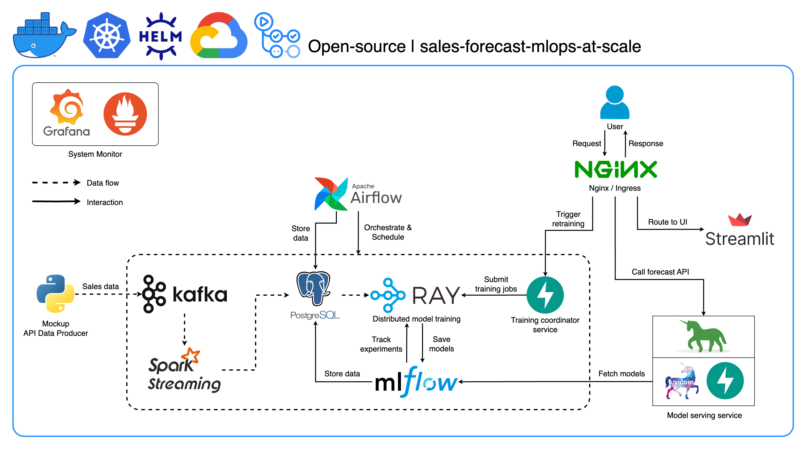
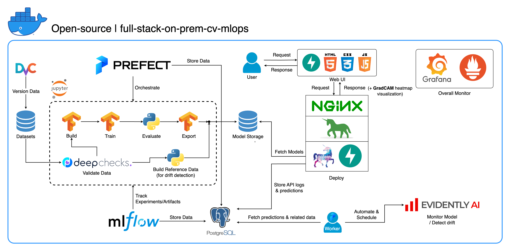
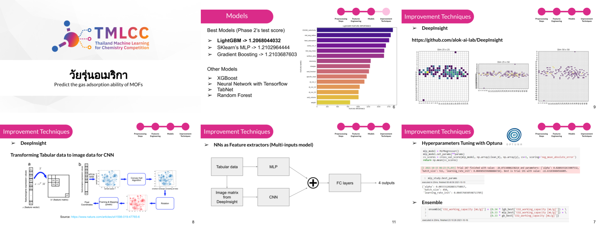

# Skills
---
- <b>Programming languages</b>: Python, SQL, JavaScripts, C++, C
- <b>MLOps/DevOps</b>: Docker, Kubernetes, Helm, MLflow, ClearML, Git, DvC, Airflow, Prefect, GitHub Actions, Gitlab CI, FastAPI, Flask, Gunicorn, Nginx, Grafana, Prometheus, Evidently, GCP, AWS
- <b>Machine Learning</b>: TensorFlow, Keras, PyTorch, Scikit-learn, Prophet, spaCy
- <b>Other</b>: LangChain, Kafka, Ray, Spark, Streamlit, OpenCV, Postgres, pytest, HTML, CSS, React
- <b>Expertise</b>: Computer Vision, Medical Imaging, System Design, Solution Achitecture

---
# Work Experience
---
## Machine Learning Engineer at [Perceptra](https://perceptra.tech/)
<b>March 2022 - _Present_</b>  
Deployed machine learning models to 100+ hospitals nationwide, accelerating cancer detection, to save lives.
 
<b>Accomplishments</b>
- Enhanced existing model serving, achieving <b>3-4x faster</b> inference time by resolving bottlenecks.
- Designed model serving architectures for <b>14+</b> disease prediction services (averaging <b>85%+ AUC</b>), covering a wide range of model types.
- Revised Docker-based ML platform and infrastructure for <b>35% smaller</b> image size and <b>3x faster</b> builds.
- Streamlined ML workflow under strict data privacy restrictions, boosting team efficiency and system reliability.
- Optimized CICD pipelines with [Gitlab CI](https://docs.gitlab.com/ee/ci/), automating testing, builds, and deployment resulting in faster deployment times and eliminating manual work.
- Developed a [YOLOv7](https://github.com/WongKinYiu/yolov7) model to identify artifacts in mammogram images, achieving <b>83% mAP@0.5</b>. This enabled dataset cleansing for improved downstream model performance.
- Developed outlier detection models and pipelines, purging 1% of low-quality data; boosted AUC by <b>1.7%</b>, sensitivity by <b>1.6%</b>, and specificity by <b>2.5%</b> across diseases.
- Introduced MLOps best practices, including data versioning ([DvC](https://dvc.org/)) and drift detection ([Evidently](https://www.evidentlyai.com/), [alibi](https://docs.seldon.io/projects/alibi-detect/en/stable/index.html)), and translated leading-edge academic research into production-ready solutions.

---
## AI Engineer Intern at [Obodroid](https://www.obodroid.com/)
<b>Jun 2021 - Jul 2021 (2 months)</b>  
Enabled surveillance robots to recognize where they are.
 
<b>Accomplishments</b>
- Involved in the "Place Recognition" part of the Robot Navigation project.
- Collected data from the real working environments.
- Adapted [SuperGlue](https://github.com/magicleap/SuperGluePretrainedNetwork) model to do Visual Place Recognition task.
- Implemented a lot of utility files for images/videos processing and running inference.
- Built a complete pipeline from raw data input to place recognition result.
- Built an end-to-end API to do Visual Place Recognition with SuperGlue and SuperPoints model using FastAPI. ([GitHub](https://github.com/jomariya23156/SuperGlue-for-Visual-Place-Recognition))

---
# Projects
---
## Sales Forecast MLOps at Scale

 

"Sales Forecast MLOps at Scale" delivers a full-stack, production-ready solution designed to streamline the entire sales forecasting system – from development and deployment to continuous improvement. It offers flexible deployment options, supporting both on-premises environments (Docker Compose, Kubernetes) and cloud-based setups (Kubernetes, Helm), ensuring adaptability to your infrastructure.

 
<b>Key Features</b>
- <b>Dual-Mode Inference</b>: Supports both batch and online inference modes, providing adaptability to various use cases and real-time prediction needs.
- <b>Automated Forecast Generation</b>: Airflow DAGs orchestrate weekly model training and batch predictions, with the ability for on-demand retraining based on the latest data.
- <b>Data-Driven Adaptability</b>: Kafka handles real-time data streaming, enabling the system to incorporate the latest sales information into predictions. Models are retrained on demand to maintain accuracy.
- <b>Scalable Pipeline and Training</b>: Leverages Spark and Ray for efficient data processing and distributed model training, ensuring the system can handle large-scale datasets and training.
- <b>Transparent Monitoring</b>: Ray and Grafana provide visibility into training performance, while Prometheus enables system-wide monitoring.
- <b>User-Friendly Interface</b>: Streamlit offers a clear view of predictions. MLflow tracks experiments and model versions, ensuring reproducibility and streamlined updates.
- <b>Best-Practices Serving</b>: Robust serving stack with Nginx, Gunicorn, and FastAPI for reliable and performant model deployment.
- <b>CI/CD Automation</b>: GitHub Actions streamline the build and deployment process, automatically pushing images to Docker Hub and GCP.
- <b>Cloud-native, Scalability and Flexibility</b>: Kubernetes and Google Cloud Platform ensure adaptability to growing data and workloads. The open-source foundation (Docker, Ray, FastAPI, etc.) offers customization and extensibility.

<b>Tools / Technologies</b>
- Platform: [Docker](https://www.docker.com/), [Kubernetes](https://kubernetes.io/), [Helm](https://helm.sh/)
- Cloud platform: [Google Cloud Platform](https://cloud.google.com/)
- Experiment tracking / Model registry: [MLflow](https://mlflow.org/)
- Pipeline orchestrator: [Airflow](https://airflow.apache.org/)
- Model distributed training and scaling: [Ray](https://www.ray.io/)
- Reverse proxy: [Nginx](https://www.nginx.com/) and [ingress-nginx](https://github.com/kubernetes/ingress-nginx) (for Kubernetes)
- Web Interface: [Streamlit](https://streamlit.io/)
- Machine Learning service deployment: [FastAPI](https://fastapi.tiangolo.com/), [Uvicorn](https://www.uvicorn.org/), [Gunicorn](https://gunicorn.org/)
- Databases: [PostgreSQL](https://www.postgresql.org/), [Prometheus](https://prometheus.io/)
- Database UI for Postgres: [pgAdmin](https://www.pgadmin.org/)
- Overall system monitoring & dashboard: [Grafana](https://grafana.com/)
- Distributed data streaming: [Kafka](https://kafka.apache.org/)
- Forecast modeling framework: [Prophet](https://facebook.github.io/prophet/docs/quick_start.html)
- Stream processing: [Spark Streaming](https://spark.apache.org/streaming/)
- CICD: [GitHub Actions](https://github.com/features/actions)

---
## Full-stack On-Premises MLOps system for Computer Vision

 

Fully operating on-premises MLOps system tailored for Computer Vision tasks from Data versioning to Model monitoring and drift detection with the concept: <b>1 config, 1 command from Jupyter Notebook to serve Millions of users"</b>. This system equips you with everything you need, from a development workspace in Jupyter Lab/Notebook to production-level services and it only takes "1 config and 1 command" to run the whole system from building the model to deployment! I've integrated numerous best practices to ensure scalability and reliability while maintaining flexibility. While my primary use case revolves around image classification, this project structure can easily adapt to a wide range of ML/DL developments, even transitioning from on-premises to cloud!

 
<b>Tools / Technologies</b>
- Platform: [Docker](https://www.docker.com/) 
- Workspace: [Jupyter Lab](https://jupyter.org/)
- Deep Learning framework: [TensorFlow](https://www.tensorflow.org/)
- Data versioning: [DvC](https://dvc.org/)
- Data validation: [DeepChecks](https://deepchecks.com/)
- Machine Learning platform / Experiment tracking: [MLflow](https://mlflow.org/)
- Pipeline orchestrator: [Prefect](https://www.prefect.io/)
- Machine Learning service deployment: [FastAPI](https://fastapi.tiangolo.com/), [Uvicorn](https://www.uvicorn.org/), [Gunicorn](https://gunicorn.org/), [Nginx](https://www.nginx.com/) (+ HTML, CSS, JS for a simple UI)
- Databases: [PostgreSQL](https://www.postgresql.org/) (SQL), [Prometheus](https://prometheus.io/) (Time-series)
- Machine Learning model monitoring & drift detection: [Evidently](https://www.evidentlyai.com/)
- Overall system monitoring & dashboard: [Grafana](https://grafana.com/)

---
## Real-time Webcam Background Replacement Web Application

 

A web application with the Zoom-like feature: Real-time webcam background replacement with a Web UI + Cartoonification + Image filters built with FastAPI using WebSocket (Also, utilizes JavaScript for frontend functionalities).  

 
<b>Key Features</b>
- <b>Dymanic background</b>: Replace the webcam background with a selected prepopulated image or one uploaded by the user.
- <b>Background model options</b>: Two available models for background segmentation: [Mediapipe](https://developers.google.com/mediapipe) (default) and 'apple/deeplabv3-mobilevit-xx-small' from [Hugging Face](https://huggingface.co/).
- <b>Cartoonification</b>: Cartoonify webcam stream with two options: [OpenCV](https://opencv.org/) (Sequence of image processings) and [CartoonGAN](https://www.kaggle.com/models/spsayakpaul/cartoongan/) (Deep learning model).
- <b>Image filters</b>: Apply filters to the webcam stream. Available filters include Grayscale, Saturation, Brightness, Contrast.
- <b>Reliability</b>: Supports concurrent connections.
- <b>Docker-based</b>: The entire app is dockerized.

---
## Face Recognition with Liveness Detection Login on Flask Web application

 

A web application login page including face verification (1-to-1 to verify whether the person who is logging in is really that person), for security purpose, with <b>liveness detection mechanism</b> (to check whether the person detected on the camera is a <b>REAL</b> person or <b>FAKE</b> (eg. image, video, etc. of that person)) for Anti-Spoofting (Others pretending to be the person). After the login page, a webpage placeholder is also provided for future use.

 
<b>Contributions</b>
- Implemented the face liveness detection method proposed in a research paper ([link](https://arxiv.org/pdf/1405.2227.pdf)).
- Collected data for real and fake images for binary classification.
- Built and trained the CNN-based liveness model from scratch with [TensorFlow](https://www.tensorflow.org/).
- Implemented the web application with [Flask](https://flask.palletsprojects.com/) framework.
- Used [dlib](http://dlib.net/) for face recognition.

---
## EzFit: Startup's MVP

<b>Pain point</b>: People are bored of exercise and lack motivation.  
<b>Solution</b>: Gamification and Multi-user Empowered by AI.  
<b>Accomplishments in Business Aspect</b>: 
- Led and envisioned a team of 5 people from different backgrounds.
- Built a full startup plan from scratch, a financial model, and a marketing plan.
- Built a pitch deck and pitched to many entrepreneurs and investors.
- Did market validation to validate the feasibility of the solution and understand customer behavior.

<b>Accomplishments in AI / App Development Aspect</b>:  
- Analyzed and drew insights with data analytics from a market validation survey.
- Collected and preprocessed data for exercise repetition counting.
- Adapted pre-trained Pose Estimation model and trained Exercise Classification models for classifying and counting the repetition of 7 exercises.
- Achieved high accuracy across all exercises: <b>99%</b> for push-up, <b>96%</b> for jumping-jack, <b>92%</b> for squat, <b>91%</b> for leg-raise, <b>84%</b> for lunge, <b>84%</b> bicycle-crunch, <b>72%</b> for mountain-climber.
- Optimized and deployed real-time ML models on the mobile device using [TensorFlow](https://www.tensorflow.org/) ecosystems.
- Built a cross-platform mobile application using [React Native](https://reactnative.dev/).
- Implemented and took care of everything in the main gameplay part.

<b>Awards</b>:
- Received a grant and advanced to demo day at Startup Thailand League 2021, one of the largest startup competitions in Thailand.
- Finalist at INNO for Change 2021, a competition organized by one of the top-tier business universities in Thailand.

<b>Main tools</b>: React Native, Expo, Firebase, TensorFlow, Tensorflow Lite, TensorFlowJS, Mediapipe

---
# Competitions
There are a lot of competitions I have attended, but here are the ones I've learned the most from and I'm allowed to open-source the work.

---
## Thailand Machine Learning for Chemistry Competition (TMLCC)

TMLCC is a new type of Data Science competition in which competitors need to use Machine Learning techniques in order to build and develop mathematic models with the ability to learn and understand the relationship between structural properties of <b>Metal-Organic frameworks (MOFs) and their Working Capacity</b>. The developed models need to be able to predict this property of other MOFs accurately and precisely.   
Briefly given a number of features of chemistry properties and molecule files, the goal is to predict the CO2 Working Capacity (how much the MOFs can absorb CO2) in mL/g. Hence this is the regression task.

We placed in <b>6th place from over 200+ teams nationwide</b>. Here are the main techniques we applied that made us stand out:
- Create many new features from feature engineering with domain expertise in Chemistry subject.
- Fill missing values in some features with Multivariate Imputation by Chained Equation (MICE) technique and Chemistry formula.
- Select features using backward elimination along with [SHAP](https://shap.readthedocs.io/en/latest/) values.
- Do hyperparameters tuning with [Optuna](https://optuna.org/).
- Use [DeepInsight](https://github.com/alok-ai-lab/DeepInsight) to transform tabular data into images and train a downstream CNN model.
- Use the trained CNN as a feature extractor to extract more features and append them to train along with other original features with [LightGBM](https://lightgbm.readthedocs.io/en/stable/). This gave us the best standalone model! 
- Ensemble models with a weighted average strategy by giving higher weight to the results from more accurate models.

---

© 2024 Ariya Sontrapornpol. Powered by Jekyll and the Minimal Theme.
