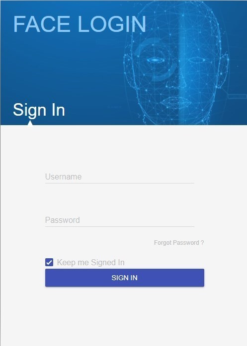

# Work Experiences
---
## Machine Learning Engineer at [Perceptra](https://perceptra.tech/)
<b>Jun 2022 - _Present_</b>  
Responsibilities
- Implement, adapt, and improve state-of-the-art neural networks / techniques from academic papers
- Deploy production-level deep learning models / services
- Optimize data pipeline and deployment processes
- Design / improve / maintain the full MLOps ecosystem

---
## ML Engineer Intern at [Perceptra](https://perceptra.tech/)
<b>Feb 2022 - Apr 2022 (3 months)</b>
- Performed transfer learning with EfficientNet v2 and further adapted network structure to do tuberculosis multi-label classification
- Performed hyperparameters tuning on the new tuberculosis classification model
- Migrated the MLOps platform from MLflow to ClearML for tuberculosis and CXR projects
- Wrote the new utility module for ClearML based projects
- Built and deployed the mammogram services (microservices) with multi-label ensemble models
- Optimized model inference process of the mammogram services to 3-4x faster
- Wrote well-detailed documentation and instructions about model deployment and MLOps

---
## AI Engineer Intern at [Obodroid](https://www.obodroid.com/)
<b>Jun 2021 - Jul 2021 (2 months)</b>
- Involved in the "Place Recognition" part of the Robot Navigation project
- Collected data from the real working environments
- Adapted SuperGlue model to do Visual Place Recognition task
- Implemented a lot of utility files for images/videos processing and running inference
- Built a complete pipeline from raw data input to place recognition result
- Built an end-to-end API to do Visual Place Recognition with SuperGlue and SuperPoints model using FastAPI ([GitHub](https://github.com/jomariya23156/SuperGlue-for-Visual-Place-Recognition))

# Projects
---
## Full-stack On-Premises MLOps system for Computer Vision

 

Fully operating on-premises MLOps system tailored for Computer Vision tasks from Data versioning to Model monitoring and drift detection with the concept: <b>1 config, 1 command from Jupyter Notebook to serve Millions of users"</b>.

---
## Real-time Webcam Background Replacement Web Application

 

Implemented a Zoom-like feature: Real-time webcam background replacement with a Web UI + Cartoonification + Image filters with FastAPI using WebSocket. (Also, utilizes JavaScript for frontend functionalities). Here are the main features of this app:
- Replace the webcam background with a selected prepopulated image or one uploaded by the user.
- Two available models for background segmentation: <b>Mediapipe</b> (default) and <b>'apple/deeplabv3-mobilevit-xx-small' from Hugging Face</b>.
- Cartoonify webcam stream with two options: <b>OpenCV</b> (Sequence of image processings) and <b>CartoonGAN</b> (Deep learning model).
- Apply filters to the webcam stream. Available filters include Grayscale, Saturation, Brightness, Contrast.
- Supports concurrent connections.

---
## Face Recognition with Liveness Detection Login on Flask Web application

 

Implemented Flask web application login page including face verification (1-to-1 to verify whether the person who is logging in is really that person), for security purpose, with liveness detection mechanism (to check whether the person detected on the camera is a <b>REAL</b> person or <b>FAKE</b> (eg. image, video, etc. of that person)), for Anti-Spoofting (Others pretending to be the person), built with Convolutional Neural Network. After the login page, a webpage placeholder is also provided for future use.

---
## Multi-Fit: Start-up's MVP

<b>Pain point:</b> People are bored of exercise and lack motivation  
<b>Solution:</b> Gamification and Multi-user Empowered by AI  
<b>Responsibility in Business Aspect:</b> 
- Led and envisioned the team
- Built a full Start-Up plan from scratch
- Built a Financial Model
- Built a Marketing Plan
- Built a pitch deck and pitched to many entrepreneurs and investors
- Did market validation

<b>Responsibility in AI / App Development Aspect:</b>  
- Led the dev team
- Analyzed and drew insights with data analytics from a market validation survey
- Collected and preprocessed data
- Adapted pre-trained Pose Estimation model and trained Pose Classification models from scratch 
- Deployed real-time ML models on the mobile device
- Took care of everything in the gameplay part

<b>Awards:</b>
- Received a grant and advanced to demo day at Startup Thailand League 2021, one of the largest startup competition in Thailand.
- Finalist at INNO for Change 2021

---

© 2024 Ariya Sontrapornpol. Powered by Jekyll and the Minimal Theme.
